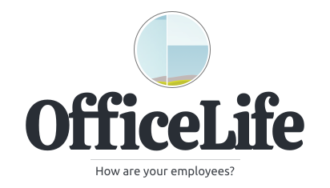
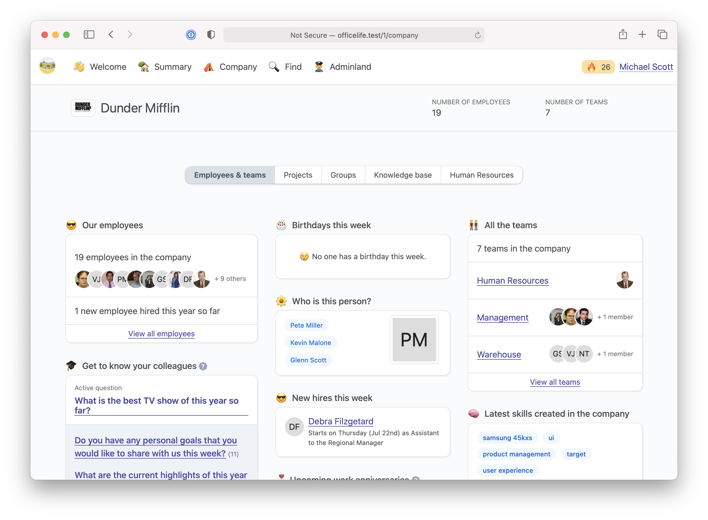
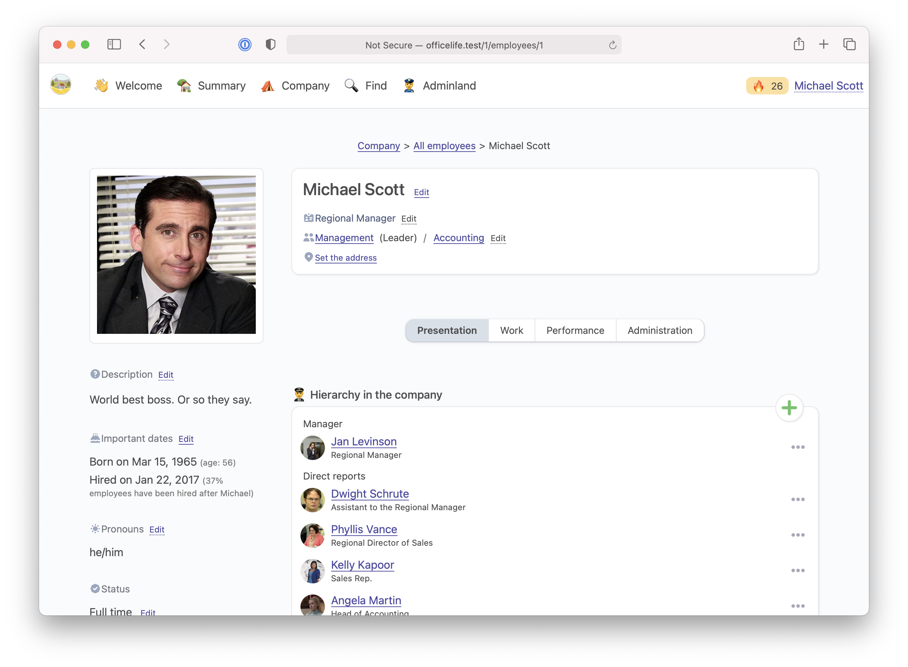

<h1 align="center">
	
</h1>

<h3 align="center">
    All-in-one software to manage the employee lifecycle
</h3>

	<strong>
		<a href="https://officelife.io/">Website</a>
		•
		<a href="https://docs.officelife.io">Docs</a>
		•
		<a href="https://demo.officelife.io/">Demo</a>
	</strong>

## What is OfficeLife

If a company wants to have a complete 360 view of what’s happening inside its walls, it needs to buy and configure a lot of tools. There is a tool for every specific aspect of a company: HR, project management, time tracking, holidays and time offs, team management, One on Ones,... There isn't a software available today, that combine all of them together in a simple way.

Not only buying and configuring all those software is a time-consuming process, but it also costs a lot of money - especially for smaller companies with a limited budget. Moreover, most of the SAAS out there have a let's-call-us-and-talk-for-an-hour-before-you-can-see-what-the-pricing-will-look-like-for-you policy, which most people hate and that we refuse to follow.

We've created OfficeLife to provide a single source of truth for everything an employee does.

OfficeLife has the following features, in 5 major domains:

* 👋 Recruit
   * Applicant tracking system
   * Onboarding / offboarding (coming soon)

* 🥸 Manage
    * Employee management
    * Team management
    * Company management

* 👷‍♀️ Operate
    * Time tracking
    * PTOs (ie holidays and time offs) (coming soon)
    * Expenses management
    * Hardware and software licenses
    * Project management

* ☎️ Communicate
    * Work logs
    * Recent ships
    * Team and company news
    * Get to know your colleagues
    * Wikis

* 🥳 Grow
    Employee and team morale
    * One on Ones
    * Rate your manager
    * Skills
    * Objectives Key Results (OKR) (coming soon)
    * e-Coffees
    * Discipline cases

To have more information about the project, check the documentation: https://docs.officelife.io/documentation/introduction.html#what-is-officelife

## Who is it for?

OfficeLife is aimed at small and medium size businesses, ranging from 10 to 500 employees. It's not suited for smaller teams, because it's collaborative. Also, it's not meant for huge companies as those companies usually have enough resources to manage a lot of different dedicated, specialized softwares.

OfficeLife is for companies that want one tool, simple enough for everybody, and hackable so it can fit your custom needs.

## Why did I create this software?

I'm ([https://twitter.com/djaiss](@djaiss)) a manager in a big corporation. We have a lot of tools that are not interconnected. And despite all those tools, I don't know what's going on inside the company, or how is an employee doing. OfficeLife is born out of my frustration with the lack of a single source of truth.

I wanted to open source this tool because I believe that collectively, we can build a better tool that everyone will benefit from. A lot of companies can't afford expensive softwares like Workday. By providing a free tool like OfficeLife, I wish employees around the world will enjoy their work more, and managers will be better at being managers.

## Get started

OfficeLife is open source, but it comes in several flavors so it fits everyone needs:

1. Use our hosted version. It's the same version that you will find here on GitHub (exactly the same).
2. Host the software yourself. We provide ample instructions on [our documentation portal](https://docs.officelife.io/documentation/installation.html#which-version-of-officelife-should-you-use).

## Requirements for hosting the software

- PHP 8.0 or higher,
- the PHP's intl extension,
- a database engine: preferrably mySQL or SQLite. PostegreSQL _should_ work, in theory.
- a http server: Nginx, Apache, Caddy, etc...
- We recommend [Forge](https://forge.laravel.com/) or [Ploi](https://ploi.io) to provision the servers needed to run OfficeLife. Heroku _should_ work too.

## Requirements for development

- Composer,
- Node and Yarn,
- A knowledge of how [Laravel](https://laravel.com), [VueJS](https://vuejs.org/) and [InertiaJS](https://inertiajs.com/) work. OfficeLife is a complex Laravel application, with a lot of queues and cron jobs.

## State of the project (as of September 06th, 2021)

The project is in beta right now, accessible from https://beta.officelife.io. The software might have some bugs that we are fixing as we find them.

* If you find any bugs, please file them by [creating a new issue](https://github.com/officelifehq/officelife/issues).
* Please don't submit new big ideas for now. We want to do a million other things with OfficeLife already. However, we seek feedback on the current features and how we could make them more useful.
* We have a documentation portal, that we slowly build: https://docs.officelife.io. It has a lot of content already, but we plan of adding much more before launching in beta.

## Core team

OfficeLife is made by [@djaiss](https://github.com/djaiss) and [@asbiin](https://github.com/asbiin).

We've made another project called [@monicahq](https://github.com/monicahq/monica).

## Contributors

This project wouldn't exist if not because of all the people who contribute. Would you like to contribute? [Here is where you can start](CONTRIBUTING.md).

    

## License

OfficeLife is open-sourced software licensed under [the BSD 3-Clause license](LICENSE). Don't be a jerk.
