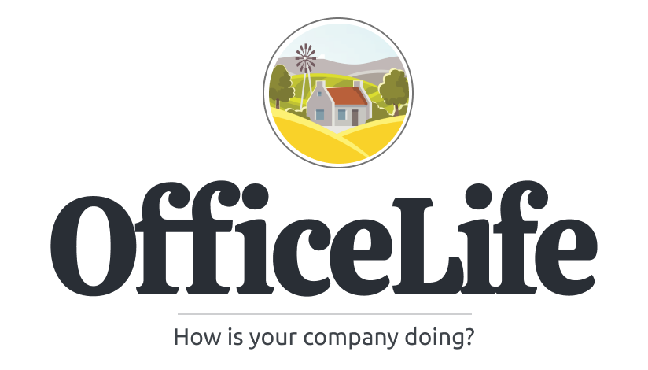

# OfficeLife

  

## Requirements for hosting the software

- PHP 7.4 or higher,
- mySQL or SQLite,
- Nginx,
- We recommend [Forge](https://forge.laravel.com/) or [Ploi](https://ploi.io) to provision the servers needed to run OfficeLife.

## Requirements for development

- [Laravel](https://laravel.com/) 7.0 or higher,
- Composer,
- Node and Yarn,
- A knowledge of how Laravel, VueJS and InertiaJS work. OfficeLife is a complex Laravel application, with a lot of queues and cron jobs.

## License

OfficeLife is open-sourced software licensed under [the BSD 3-Clause license](LICENSE).