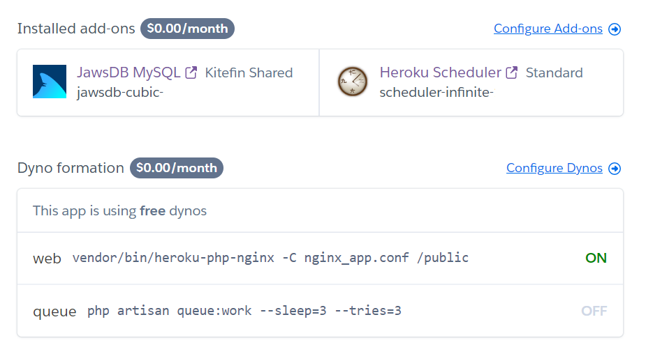

# Installing on Heroku <!-- omit in toc -->

Officelife can be deployed on Heroku using the button below:

[](https://heroku.com/deploy?template=https://github.com/officelifehq/officelife/tree/main)

- [Installation](#installation)

## Installation

Before deployment, Heroku will ask you to define a few variables.
- Please ensure to enter a custom `APP_KEY` when asked (for instance you can use this command to generate the key: `echo -n 'base64:'; openssl rand -base64 32`).

After deployment, click on  to open the dashboard of your new application:


Click on **Heroku Scheduler** to open scheduler dashboard. Create a new job, and define a new job to run this command every 10 minutes or every hour at 00 minutes:
```sh
php artisan schedule:run
```

You are now able to open the application and register a new user.
